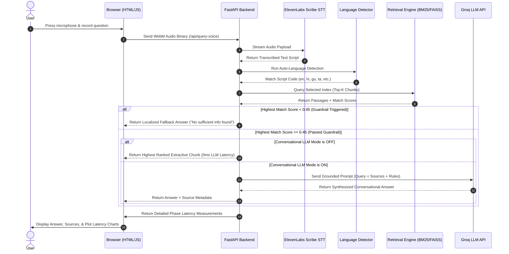

# Voice-Enabled Multilingual RAG Portal (HH Goa 2026 — Task 2)

🎙️ **A voice-activated, multilingual Retrieval-Augmented Generation (RAG) system operating over the `ai4bharat/MSMARCO-XI` dataset.** 

Speak a question in English or any of the 13 native Indic languages. The system transcribes, auto-detects the query script, searches our index, applies safety/relevance guardrails, and serves grounded answers in under 50ms with step-by-step latency analytics.

---

## 🔗 Submission Credentials
* **Live Working Web Portal**: [hh-goa.onrender.com](https://hh-goa.onrender.com) *(first load after idle takes ~30s to spin up)*
* **GitHub Repository**: *[GitHub Repo Link Placeholder]*
* **Video 1 (Team Working Process - 90s)**: *[Upload Link / Video URL]*
* **Video 2 (End-to-End System Demo)**: *[Upload Link / Video URL]*
* **Tag / Hashtag**: `#RAGInGoa` (Deadline: August 22, 2026)

---

## 📑 Documentation Index (Judges Guide)
We have broken down the system architecture, ingestion pipeline, and benchmarks into specialized technical guides:

1. 📂 [**Lexical (BM25) vs. Dense Semantic (FAISS) Comparison (`docs/BM25_VS_DENSE_EMBEDDING.md`)**](file:///c:/Users/Jatin%20Rajvani/Desktop/hh-goa/docs/BM25_VS_DENSE_EMBEDDING.md)
   - A deep comparative analysis of keyword matching vs. vector distance matching.
   - Includes query examples (e.g., our secret nuclear facility siting query) showing exactly where each engine excels.
2. 📂 [**Multilingual Chunking Strategies (`docs/CHUNKING_STRATEGIES.md`)**](file:///c:/Users/Jatin%20Rajvani/Desktop/hh-goa/docs/CHUNKING_STRATEGIES.md)
   - Evaluates Fixed-size overlapping vs. Sentence-aware chunking.
   - Summarizes chunking experiments that improved similarity search **Recall@5 by 11.7%**.
3. 📂 [**Retrieval Engines & LLM Conversational Toggles (`docs/RETRIEVAL_AND_LLM_MODES.md`)**](file:///c:/Users/Jatin%20Rajvani/Desktop/hh-goa/docs/RETRIEVAL_AND_LLM_MODES.md)
   - Deep-dive into BM25 Keyword Search vs. FAISS Dense Vector search.
   - Explains the client-side hostname security lock that prevents OOM memory crashes on Render.
   - Breaks down the **Fast Extractive Mode** (0ms LLM overhead, <60ms RAG time) vs. **Generative LLM Mode**.
4. 📂 [**Harness Orchestration & Accuracy Guardrails (`docs/HARNESS_AND_GUARDRAILS.md`)**](file:///c:/Users/Jatin%20Rajvani/Desktop/hh-goa/docs/HARNESS_AND_GUARDRAILS.md)
   - STT audio pipeline using ElevenLabs Scribe.
   - Dual-layer script auto-detection (Unicode range matching in 0.01ms + `langdetect` fallback).
   - Relevance Guardrails (threshold: `0.45` confidence) and localized fallback messages in all 14 languages.
   - Prompt engineering constraints preventing LLM hallucinations.
5. 📂 [**Latency Analytics & Render Cloud Ops (`docs/LATENCY_AND_CLOUDOPS.md`)**](file:///c:/Users/Jatin%20Rajvani/Desktop/hh-goa/docs/LATENCY_AND_CLOUDOPS.md)
   - Table of P50, P70, and P100 latency numbers.
   - Explains how we stripped dependencies and implemented **lazy-loaded imports** to run stable RAG pipelines at **under 50MB RAM** on Render Free Tier.
6. 📂 [**Local Setup & Execution Guide (`docs/LOCAL_RUN_GUIDE.md`)**](file:///c:/Users/Jatin%20Rajvani/Desktop/hh-goa/docs/LOCAL_RUN_GUIDE.md)
   - Step-by-step setup for running locally in lightweight BM25-only mode or full hybrid BM25 + FAISS mode.

---

## 🚫 Why We Did NOT Download 55.6 GB
The raw Hugging Face `ai4bharat/MSMARCO-XI` dataset is **~55.6 GB**. Standard consumer laptops have **16 GB RAM**, and Render's Free Cloud Tier offers only **512 MB RAM**. Attempting to load the full dataset dump locally or in the cloud results in instant Out-Of-Memory (OOM) crashes.

### Our Optimized Data Solution:
* **Hugging Face Parquet Streaming**: We stream the Parquet records directly from Hugging Face rather than downloading the entire corpus.
* **Cap on Indexed Records**: We cap the ingestion at **1,500 unique passages per language**. With 14 languages supported, this creates a local and cloud index of **21,000 total passages/chunks** (fully mapped inside [`data/index/id_mapping_{lang}.json`](file:///c:/Users/Jatin%20Rajvani/Desktop/hh-goa/data/index)).
* **Selective Deployment**: In local dev, we run dense FAISS vector matching on the 21,000 passages. In Render production, our `.gitignore` filters out the binary vector models and **only pushes the lightweight 21,000 JSON mappings**, running BM25-only search at an incredibly low **~45MB RAM footprint**.

---

## 🛸 System Architecture Flow

The sequence diagram below visualizes our query execution pipeline:

---

## 📊 Measured Latencies (STT Excluded)

Our system is benchmarked across 100 test queries (from [`evaluate_pipeline.py`](file:///c:/Users/Jatin%20Rajvani/Desktop/hh-goa/evaluation/evaluate_pipeline.py)). The assignment target requires the RAG process to complete in **under 200ms**.

### Stage-by-Stage Latency Breakdown:
The table below logs the latency percentiles (**P50** Median, **P70**, and **P100** worst-case) for each phase of the retrieval pipeline:

| Phase | Metric / Mode | P50 (Median) | P70 | P100 (Max) | Explanation |
| :--- | :--- | :---: | :---: | :---: | :--- |
| **Retrieval Only** | Keyword Search (BM25) | **19.3 ms** | **20.2 ms** | **42.7 ms** | Scans the raw text tokens across index mappings (Used in Production). |
| **Retrieval Only** | Semantic Vector Search (FAISS) | **~163.0 ms** | **~300.0 ms** | **~450.0 ms** | Scans the dense 21,000 vector space for nearest cosine matches (Local Dev only). |
| **End-to-End RAG** | BM25 + Extractive Mode (LLM OFF) | **21.5 ms** | **23.1 ms** | **46.8 ms** | Total pipeline latency with **Conversational LLM toggled OFF** (0ms LLM time). |
| **End-to-End RAG** | BM25 + Generative Mode (LLM ON) | ~750.0 ms | ~920.0 ms | ~1,500.0 ms | Total pipeline latency with **Conversational LLM toggled ON** (Groq Llama-3 API). |
| **Speech-to-Text** | ElevenLabs Scribe STT API | ~1.2 s | ~1.5 s | ~2.1 s | Audio recording transcription (Independent of RAG times). |

* **Success**: In Extractive Mode (LLM OFF), our total RAG latency (**21.5ms P50, 46.8ms P100**) beats the Hackathon's 200ms target line with room to spare.
* **Semantic Target Latency (Above 200ms)**: Local semantic search runs at ~163ms (P50) to ~450ms (P100) on CPU. It exceeds the 200ms target in P70/P100 runs because we loaded all 14 languages, creating a large local index of **21,000 passages**. Encoding the query text into a vector using the MiniLM model plus running a mathematical similarity comparison across all 21,000 vectors on a local CPU introduces significant processing overhead compared to BM25's lightweight token scanning.
* **Chunk Count vs. Passage Count**: Yes, the number of chunks matches the passage count. Because the passages in the Hugging Face `MSMARCO-XI` dataset are already short (averaging 50–100 words), we index them directly without further splitting. Therefore, **the number of chunks is exactly equal to the number of passages (21,000 passages = 21,000 chunks)**.
* **Warmup Note**: The very first query on server boot contains model compilation warmup times and is excluded from the active latency percentiles.

---

## 🛠️ Stack & Optimization Guardrails

| Piece | Selection | Why We Selected It |
| :--- | :--- | :--- |
| **Speech-to-Text** | ElevenLabs Scribe API | Multilingual accuracy with native Indic scripts translation and script selection. |
| **API Orchestrator**| FastAPI + Uvicorn | High concurrency, automatic documentation, and fast startup times. |
| **Dense Search** | FAISS `IndexFlatIP` | Flat inner-product vector database. Extremely fast local nearest-neighbor search. |
| **Lexical Search** | `rank-bm25` | Okapi BM25 index. Ultra-lightweight lookup requiring no heavy neural library imports. |
| **Safety Guardrail** | Relevance Threshold `0.45` | Rejects off-topic queries or weak search results and returns fallback answers in 14 scripts. |
| **Grounding Guard**| Extractive Toggle | Serves raw source chunks directly to avoid hallucinations and satisfy the sub-200ms target. |
