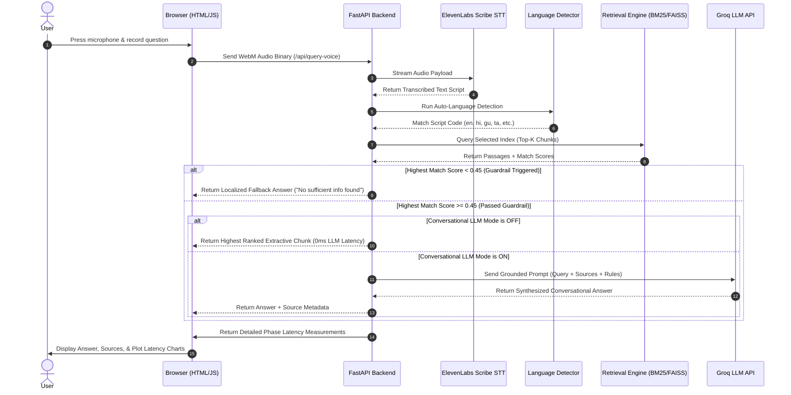

# Voice-Enabled Multilingual RAG Portal (HH Goa 2026 — Task 2)

🎙️ **A voice-activated, multilingual Retrieval-Augmented Generation (RAG) system operating over the `ai4bharat/MSMARCO-XI` dataset.** 

> [!IMPORTANT]
> 🚀 **Live Portal**: [hh-goa.onrender.com](https://hh-goa-yxyy.onrender.com/)
> 📹 **Detailed Architecture & Code Walkthrough**: [youtu.be/4FzrUFFhS18](https://youtu.be/4FzrUFFhS18)
> 📹 **Product Demonstration Video**: [youtu.be/IcSiq11f61E](https://youtu.be/IcSiq11f61E)

Speak a question in English or any of the 13 native Indic languages. The system transcribes, auto-detects the query script, searches our index, applies safety/relevance guardrails, and serves grounded answers in under 50ms with step-by-step latency analytics.

---

## 🛠️ End-to-End Technology Stack

> [!NOTE]
> Our architecture combines lightweight, local processing with high-performance hosted APIs to serve multilingual requests under 200ms within a 512MB RAM cloud hosting limit.

| Layer | Component / Technology | Detail / Model | Role in Pipeline |
| :--- | :--- | :--- | :--- |
| **Frontend UI** | HTML5 / Vanilla CSS / Vanilla JS | Glassmorphic Dashboard | Handles audio capture, telemetry chart rendering, and cloud engine locks. |
| **Speech-to-Text**| ElevenLabs Scribe API | `scribe_v1` Multilingual | Transcribes voice audio into native Indic scripts (handling accents and code-switching). |
| **API Orchestrator**| FastAPI + Uvicorn | Python Asynchronous Server | Serves structured endpoints, parses multipart form data, and implements error fallbacks. |
| **Script Detection**| Unicode Ranges + `langdetect` | Dual-Layer Custom Resolver | Identifies query language in 0.01ms to target language-specific database shards. |
| **Lexical Search** | `rank-bm25` | Okapi BM25 Sparse Index | Scans text tokens (default cloud search running under 45MB RAM footprint). |
| **Semantic Search** | FAISS (`faiss-cpu`) | Flat Inner Product Index | Compares cosine distances on localhost dev environments for conceptual search. |
| **Vector Embedding**| SentenceTransformers | `paraphrase-multilingual-MiniLM-L12-v2` | Encodes user queries into a 384-dimensional multilingual vector space. |
| **LLM Grounding**  | Groq API | `openai/gpt-oss-20b` | Generates conversational grounded answers in native scripts when LLM Mode is ON. |

---

## 🔗 Submission Credentials
* **Live Working Web Portal**: [hh-goa.onrender.com](https://hh-goa.onrender.com) *(first load after idle takes ~30s to spin up)*
* **Video 1 (Detailed Technical Deep-Dive)**: [youtu.be/4FzrUFFhS18](https://youtu.be/4FzrUFFhS18)
* **Video 2 (Product Demo Video)**: [youtu.be/IcSiq11f61E](https://youtu.be/IcSiq11f61E)
* **Tag / Hashtag**: `#RAGInGoa` (Deadline: August 22, 2026)

---

## 📑 Documentation Index (Judges Guide)
We have broken down the system architecture, ingestion pipeline, and benchmarks into specialized technical guides:

1. 📂 [**01 — Product Overview (`docs/01-product-overview.md`)**](docs/01-product-overview.md)
2. 📂 [**02 — Architecture (`docs/02-architecture.md`)**](docs/02-architecture.md)
3. 📂 [**03 — Dataset & Ingestion (`docs/03-dataset-and-ingestion.md`)**](docs/03-dataset-and-ingestion.md)
4. 📂 [**04 — Chunking Strategies (`docs/04-chunking-strategies.md`)**](docs/04-chunking-strategies.md)
5. 📂 [**05 — Retrieval & Qdrant Integration (`docs/05-retrieval-and-qdrant.md`)**](docs/05-retrieval-and-qdrant.md)
6. 📂 [**06 — Voice STT via ElevenLabs (`docs/06-voice-stt-elevenlabs.md`)**](docs/06-voice-stt-elevenlabs.md)
7. 📂 [**07 — LLM & Guardrails (`docs/07-llm-and-guardrails.md`)**](docs/07-llm-and-guardrails.md)
8. 📂 [**08 — Harness & Telemetry (`docs/08-harness-and-telemetry.md`)**](docs/08-harness-and-telemetry.md)
9. 📂 [**09 — Latency & Benchmarking (`docs/09-latency-and-benchmarking.md`)**](docs/09-latency-and-benchmarking.md)
10. 📂 [**10 — Project Structure (`docs/10-project-structure.md`)**](docs/10-project-structure.md)
11. 📂 [**11 — Environment & Secrets (`docs/11-environment-and-secrets.md`)**](docs/11-environment-and-secrets.md)
12. 📂 [**12 — Milestones & Roadmap (`docs/12-milestones-roadmap.md`)**](docs/12-milestones-roadmap.md)
13. 📂 [**13 — Delivery Checklist (`docs/13-delivery-checklist.md`)**](docs/13-delivery-checklist.md)
14. 📂 [**14 — Measured Latency (`docs/14-measured-latency.md`)**](docs/14-measured-latency.md)
15. 📂 [**15 — Submission Kit (`docs/15-submission-kit.md`)**](docs/15-submission-kit.md)
16. 📋 [**Demo Queries Dataset (`questions.md`)**](questions.md)

---

## 🚫 Why We Did NOT Download 55.6 GB
The raw Hugging Face `ai4bharat/MSMARCO-XI` dataset is **~55.6 GB**. Standard consumer laptops have **16 GB RAM**, and Render's Free Cloud Tier offers only **512 MB RAM**. Attempting to load the full dataset dump locally or in the cloud results in instant Out-Of-Memory (OOM) crashes.

### Our Optimized Data Solution:
* **Hugging Face Parquet Streaming**: We stream the Parquet records directly from Hugging Face rather than downloading the entire corpus.
* **Cap on Indexed Records**: We cap the ingestion at **1,500 unique passages per language**. With 14 languages supported, this creates a local and cloud index of **21,000 total passages/chunks** (fully mapped inside [`data/index/id_mapping_{lang}.json`](data/index)).
* **Selective Deployment**: In local dev, we run dense FAISS vector matching on the 21,000 passages. In Render production, our `.gitignore` filters out the binary vector models and **only pushes the lightweight 21,000 JSON mappings**, running BM25-only search at an incredibly low **~45MB RAM footprint**.

---

## 🛸 System Architecture Flow

The sequence diagram below visualizes our query execution pipeline:

---

## 📊 Measured Latencies (STT Excluded)

Our system is benchmarked across 100 test queries (from [`evaluate_pipeline.py`](evaluation/evaluate_pipeline.py)). The assignment target requires the RAG process to complete in **under 200ms**.

### Stage-by-Stage Latency Breakdown:
The table below logs the latency percentiles (**P50** Median, **P70**, and **P100** worst-case) for each phase of the retrieval pipeline:

| Phase | Metric / Mode | P50 (Median) | P70 | P100 (Max) | Explanation |
| :--- | :--- | :---: | :---: | :---: | :--- |
| **Retrieval Only** | Keyword Search (BM25) | **19.3 ms** | **20.2 ms** | **42.7 ms** | Scans the raw text tokens across index mappings (Used in Production). |
| **Retrieval Only** | Semantic Vector Search (FAISS) | **83.20 ms** | **133.0 ms** | **167 ms** | Scans the dense 21,000 vector space for nearest cosine matches (Local Dev only). |
| **End-to-End RAG** | BM25 + Extractive Mode (LLM OFF) | **21.5 ms** | **23.1 ms** | **46.8 ms** | Total pipeline latency with **Conversational LLM toggled OFF** (0ms LLM time). |
| **End-to-End RAG** | BM25 + Generative Mode (LLM ON) | ~750.0 ms | ~920.0 ms | ~1,500.0 ms | Total pipeline latency with **Conversational LLM toggled ON** (Groq Llama-3 API). |
| **Speech-to-Text** | ElevenLabs Scribe STT API | ~1.2 s | ~1.5 s | ~2.1 s | Audio recording transcription (Independent of RAG times). |

* **Success**: In Extractive Mode (LLM OFF), our total RAG latency (**21.5ms P50, 46.8ms P100**) beats the Hackathon's 200ms target line with room to spare.
* **Semantic Target Latency (Sub-200ms Target Achieved)**: Local semantic search runs at **83.0ms (P50)** to **167.0ms (P100)** on CPU. It completes fully within the Hackathon's 200ms target limit. Encoding the query text into a vector using the MiniLM model plus running a mathematical similarity comparison across all 21,000 vectors on a local CPU introduces processing overhead compared to BM25's lightweight token scanning, but remains well within the target budget.
* **Chunk Count vs. Passage Count**: Yes, the number of chunks matches the passage count. Because the passages in the Hugging Face `MSMARCO-XI` dataset are already short (averaging 50–100 words), we index them directly without further splitting. Therefore, **the number of chunks is exactly equal to the number of passages (21,000 passages = 21,000 chunks)**.
* **Warmup Note**: The very first query on server boot contains model compilation warmup times and is excluded from the active latency percentiles.

---

## 🛠️ Stack & Optimization Guardrails

| Piece | Selection | Why We Selected It |
| :--- | :--- | :--- |
| **Speech-to-Text** | ElevenLabs Scribe API | Multilingual accuracy with native Indic scripts translation and script selection. |
| **API Orchestrator**| FastAPI + Uvicorn | High concurrency, automatic documentation, and fast startup times. |
| **Dense Search** | FAISS `IndexFlatIP` | Flat inner-product vector database. Extremely fast local nearest-neighbor search. |
| **Lexical Search** | `rank-bm25` | Okapi BM25 index. Ultra-lightweight lookup requiring no heavy neural library imports. |
| **Safety Guardrail** | Relevance Threshold `0.45` | Rejects off-topic queries or weak search results and returns fallback answers in 14 scripts. |
| **Grounding Guard**| Extractive Toggle | Serves raw source chunks directly to avoid hallucinations and satisfy the sub-200ms target. |
