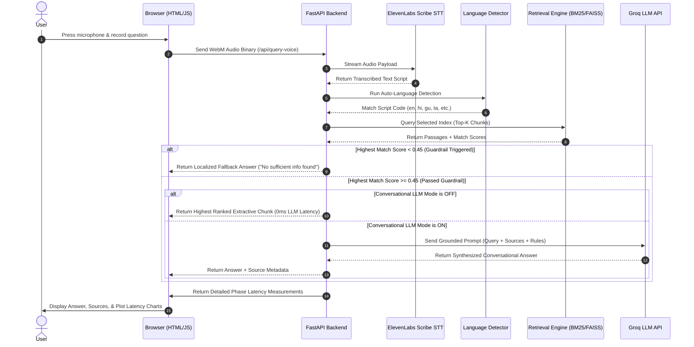

# 02 — Architecture

This document describes the end-to-end subsystem layout and data flow.

---

##  UFO Sequence Diagram
The sequence diagram below visualizes how a voice-initiated request moves through the system:

---

## 🧱 Component Breakdown

### 1. Frontend Web App (Browser client)
*   **Technologies**: HTML5, Vanilla CSS (Glassmorphic theme), JavaScript.
*   **Recording**: Captures mic audio via `MediaRecorder` API into a **WebM** buffer stream.
*   **Latency Monitoring**: Logs timestamps for API roundtrips and visualizes sub-millisecond stage latencies in a latency dashboard (using dynamic status indicators).

### 2. FastAPI Orchestration Server
*   **Endpoint `/api/query-text`**: Serves text-based searches.
*   **Endpoint `/api/query-voice`**: Receives voice files, routes them to STT, detects query languages, runs retrieval searches, applies guardrails, invokes the LLM (if selected), and aggregates latencies.

### 3. Speech-to-Text (STT) Service
*   **Integration**: ElevenLabs Scribe API.
*   **Script Handling**: Recovers transcribing output directly in native scripts (e.g. Gujarati script for Gujarati audio), bypassing translating steps prior to retrieval.

### 4. Language Auto-Detector
*   **Layer 1 (Unicode Script Bounds)**: Matches character ranges to map languages in **0.01ms** (e.g. Tamil range `0x0b80` to `0x0bff` maps directly to `ta`).
*   **Layer 2 (langdetect Fallback)**: Resolves shared Devanagari range scripts (Hindi, Marathi, Sanskrit, Nepali) and English.

### 5. Dual Retrieval Engine
*   **Okapi BM25 Index**: Pure Python text token-scanning. Runs in cloud production at low memory.
*   **FAISS Vector Index**: Dense vector database executing Cosine Similarity nearest-neighbor search. Utilizes `paraphrase-multilingual-MiniLM-L12-v2`.

### 6. Grounding Guardrail
*   Rejects matches with scores below `0.45` confidence, blocking downstream LLM calls and serving localized fallback messages to prevent hallucinations.
