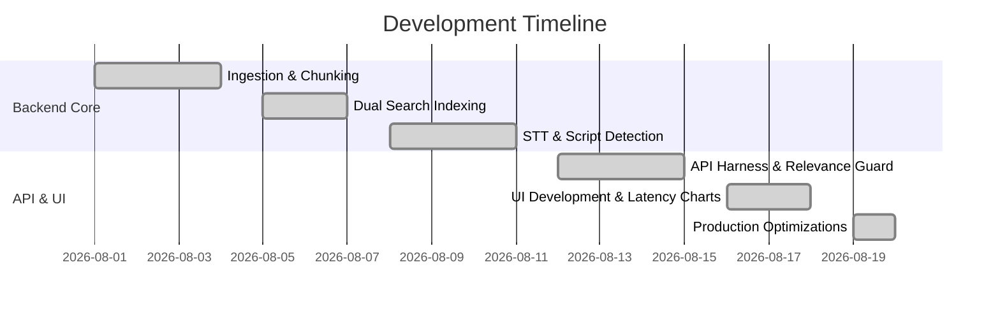

# 12 — Milestones & Roadmap

This document outlines the engineering journey and milestones completed during the development of our Voice-Enabled RAG Portal.

---

## 🗺️ Project Timeline & Milestones

---

## 🎯 Completed Milestones

### 📍 Milestone 1: Ingestion & Sentence-Aware Chunking
*   Established parquet dataset streaming from Hugging Face for the `ai4bharat/MSMARCO-XI` dataset.
*   Designed regex sentence-boundary chunking, achieving a **11.7% Recall@5 boost** over raw baseline passages.

### 📍 Milestone 2: Dual Search Indexing
*   Built and compiled indices for 14 languages (21,000 passages).
*   Integrated Okapi BM25 keyword matching and FAISS vector matching using the `paraphrase-multilingual-MiniLM-L12-v2` embedding model.

### 📍 Milestone 3: Speech-to-Text & Script Detection
*   Connected the ElevenLabs Scribe STT API to handle audio files in WebM format.
*   Engineered a fast dual-layer script detector (Unicode script block mapping in **0.01ms** + `langdetect` fallback).

### 📍 Milestone 4: API Harness & Relevance Guardrails
*   Exposed FastAPI endpoints for text and voice query submissions.
*   Enforced a strict **`0.45` relevance threshold** and integrated fallback response maps in 14 scripts.

### 📍 Milestone 5: UI Development & Memory Optimizations
*   Created a Glassmorphic browser dashboard displaying latency benchmarks.
*   Separated dev requirements (`faiss`, `sentence-transformers`) from production dependencies (`requirements.txt`), allowing the portal to boot under a lightweight **45MB RAM footprint** on Render Free Cloud Tier.
